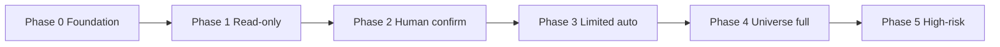

# VIONA AI Phase Roadmap

**Pack:** `VIONA.AI_AUTOMATION_READINESS_DOCS.PACK_AI0`
**Document type:** AI foundation policy — phase law before live automation
**Audience:** Product, engineering, AI Safety & Production Reliability Lead, Compliance, operators
**Relationship:** Subordinate to `VIONA_OPERATING_PROTOCOL.md` and Master Blueprint. Blueprint wins on signed conflicts.

---

## Core AI law

VIONA AI must advance in **phases**. No universe may skip phases to claim production autonomy. Internal labels (**Lite**, **Pilot**, **Demo**, **Gated**, **Beta**) describe readiness — not reduced global product scope.

| Phase | Name | What is allowed | What is forbidden |
| --- | --- | --- | --- |
| **0** | Foundation / policy / source-of-truth | Docs, permission matrix, readiness matrix, audit log schema, cost guard design, feature-flag semantics, rollback path, manual audit tools | Live model calls that mutate money, booking, SOS, identity, or tenant state |
| **1** | Read-only copilot | Explain UI, summarize visible context, translate, navigation help, read profile/catalog/request state **as returned by backend** | Drafts that auto-submit; hidden tool use; claims without SoT |
| **2** | Human-confirmed action assistant | Draft requests, replies, forms, booking leads; propose next steps; require explicit user/merchant/admin tap | Auto-confirm, auto-pay, auto-dispatch, auto-call without confirmation |
| **3** | Limited automation | Bounded automations with policy engine, rate limits, audit trail, kill switch, per-universe gates | Cross-tenant actions; money movement; SOS live automation; uncapped spend |
| **4** | Full active by universe | Universe owner signs production gates; AI tools enabled per `VIONA_AI_TOOL_PERMISSION_MATRIX.md` for that universe | Capabilities outside signed universe scope |
| **5** | High-risk autonomy | AI telephony, outbound calling, recording, dispatch assistance, merchant ops automation — **only** after legal, backend, ops, and cost gates | Any autonomy before consent matrix, recording law review, and incident runbooks |

---

## Phase 0 — Foundation (current target)

**Goal:** Safe skeleton before any expansion of live AI behavior.

### Deliverables

| Artifact | Path | Status |
| --- | --- | --- |
| Phase roadmap | `docs/ai-context/VIONA_AI_PHASE_ROADMAP.md` | This doc |
| Tool permission matrix | `docs/ai-context/VIONA_AI_TOOL_PERMISSION_MATRIX.md` | Pack AI0 |
| Universe readiness matrix | `docs/ai-context/VIONA_AI_AUTOMATION_READINESS_MATRIX.md` | Pack AI0 |
| Route capability inventory | `docs/ai-context/VIONA_ROUTE_CAPABILITY_INVENTORY.md` | Imported (D3) |
| Forbidden claims checker | `scripts/viona-forbidden-claims-check.mjs` | Imported (D2B/D2E) |
| AI safety readiness check | `scripts/viona-ai-safety-readiness-check.mjs` | Pack AI0 (optional) |

### Phase 0 requirements

1. **Policy & permission matrix** — every tool/action classified before implementation.
2. **Source-of-truth map** — what data AI may read vs must not invent (see readiness matrix § Source-of-truth).
3. **Audit log contract** — who, what universe, what tool, what inputs hash, what outcome, human confirmation id (design only in Phase 0).
4. **Cost guard** — per-user/session/tenant budgets, model tier caps, circuit breaker (design + flags; no uncapped live spend).
5. **Feature flags** — AI surfaces gated by universe, market, role, and phase.
6. **Rollback / fallback** — disable AI tools globally or per universe without breaking core app navigation.

### Phase 0 exit criteria

- [ ] All eight universes have current phase + blockers documented.
- [ ] Tool permission matrix covers all action types in scope.
- [ ] Forbidden autonomy list reviewed by AI Safety & Trust & Safety leads.
- [ ] No new BLOCKER from `viona-forbidden-claims-check.mjs --strict`.
- [ ] Operator sign-off before enabling Phase 1 tools in any universe.

---

## Phase 1 — Read-only copilot

**User promise:** AI helps you understand and navigate — it does not act for you.

### Allowed

- Navigation help (“where is Local requests?”)
- Translation and phrase suggestions (Smart Trio)
- Summarization of **already-fetched** request/booking/profile snippets
- Explaining labels: Lite, Pilot, Demo, Gated
- FAQ from approved knowledge base

### Forbidden

- Writing to booking/request/payment APIs
- Pretending a draft was submitted
- Inventing merchant availability, prices, or SOS outcomes

### Production gates (before Phase 1 live in a universe)

- Universe SoT endpoints documented and tested read-only
- Rate limits and cost caps configured
- Audit log write path exists (even if UI is internal-only)
- Copilot copy states **read-only** where relevant

---

## Phase 2 — Human-confirmed action assistant

**User promise:** AI proposes; human confirms every mutation.

### Allowed

- Local service request **draft**
- Booking request **draft**
- Merchant reply **draft**
- Profile update **draft**
- Form prefill from SoT + user edit before submit

### Confirmation rules

| Action class | Who confirms |
| --- | --- |
| Consumer draft submit | End user tap + consent where required |
| Merchant reply send | Merchant user tap |
| Admin/config change | Admin role + audit entry |
| Payment-adjacent draft | **Forbidden** until Phase 3+ with payment gates — drafts only, no capture |

### Forbidden

- Silent submit after draft generation
- “AI confirmed your booking” copy without server confirmation state

---

## Phase 3 — Limited automation

**User promise:** Narrow, policy-bound automations with kill switch.

### Examples (universe-specific, gated)

- Auto-ack inbound merchant inbox with template (merchant opt-in)
- Reminder nudges for stale drafts (no payment)
- Catalog import **suggestions** for B2B (human approval queue)

### Required controls

- Policy engine allowlist per tool
- Per-tenant isolation tests
- Cost firewall enforced
- Incident runbook + on-call for AI outages

### Still forbidden

- Payment capture, wallet debit, refund execution
- SOS dispatch, live GPS share, emergency outbound call
- Final medical/legal/financial advice

---

## Phase 4 — Full active by universe

**User promise:** Universe owner declares production-ready AI for signed scope only.

Each universe graduates independently. Home may be Phase 2 while Travel remains Phase 1.

### Per-universe sign-off requires

| Gate | Owner role |
| --- | --- |
| SoT completeness for that universe | Mini-App Owner + Principal Architect |
| Tool matrix entries implemented match doc | AI Safety Lead |
| Cost and abuse limits | AI Safety + Ops |
| Copy honesty (no fake production) | Trust & Safety + CPO |
| Locale/market disclaimers | Compliance |

---

## Phase 5 — High-risk autonomy

**User promise:** Only after legal, backend, and ops readiness — never by default globally.

### High-risk capabilities

- AI calling humans (outbound PSTN/VoIP)
- AI-assisted emergency call routing
- Recording / transcript retention
- Merchant receptionist auto-booking with telephony
- Autonomous catalog publish to live shop

### Mandatory gates (all required)

- Legal/compliance review per market
- Consent UX for recording, location, outbound call
- Verified backend webhooks / idempotency for any side effect
- Human escalation path and incident commander runbook
- Cost ceiling with automatic shutoff
- Founder or delegate written approval for wave

---

## Phase progression diagram

**Rule:** Skipping phases requires Executive Sponsor + AI Safety Lead documented exception — not default engineering path.

---

## Related documents

- `docs/ai-context/VIONA_AI_TOOL_PERMISSION_MATRIX.md`
- `docs/ai-context/VIONA_AI_AUTOMATION_READINESS_MATRIX.md`
- `docs/ai-context/VIONA_FORBIDDEN_CLAIMS_CHECKER.md`
- `docs/ai-context/VIONA_ROUTE_CAPABILITY_INVENTORY.md`
- `docs/ai-context/VIONA_AI_CALL_AND_INDUSTRY_RECEPTIONIST_ARCHITECTURE.md`
