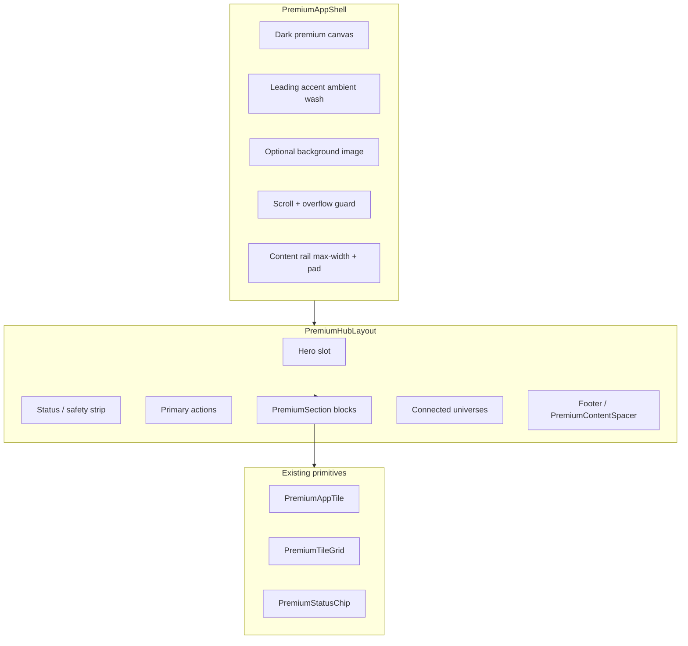

# VIONA Wave 3B — Premium App Shell Foundation

**Pack:** `VIONA.WAVE_3B.PREMIUM_APP_SHELL_FOUNDATION.1`  
**Status:** **COMPLETE (foundation only)** — primitives + tokens landed; **no hub screen migration in this pack**  
**Date (UTC):** 2026-05-24  
**Baseline HEAD:** `0959dcc`  
**Classification:** Layout/design foundation — **not** production launch, **not** commercial/Global Active, **not** native PASS

---

## 1. Why screen-by-screen patching is insufficient

Wave 3B improved Local (and partial Travel/Academy) by editing individual screens: custom rails, one-off padding, duplicated overflow fixes, and per-hub glass stacks (`LocalConstellationFrame`, `TravelGlassCard`, etc.). Real screenshots show:

- **Inconsistent** hub anatomy and bottom chrome handling  
- **390×844** remains fragile when each screen invents its own width math  
- **Merchant dashboard** and legacy list surfaces still diverge from the north-star  
- **Semantic color** governance exists in tokens but layout layers do not share one shell  

This pack stops isolated patches and introduces **reusable layout primitives** so migration packs recompose hubs—not rewrite chrome each time.

**This pack does not change any committed hub UI.** Consumers adopt in follow-up packs.

---

## 2. Shell / layer architecture



| Layer | Component / module | Responsibility |
|-------|-------------------|----------------|
| **Canvas** | `PremiumAppShell` | Dark field, safe width, mobile overflow, bottom clearance, optional header offset |
| **Anatomy** | `PremiumHubLayout` | Ordered slots: hero → safety → actions → sections → universes → footer |
| **Section** | `PremiumSection` | Kicker, title, subtitle, optional action, children grid |
| **Spacer** | `PremiumContentSpacer` | Dock + tab bar scroll padding helper |
| **Tiles** | `PremiumAppTile`, `PremiumTileGrid` | Feature modules (unchanged; already Wave 3B) |
| **Tokens** | `premiumTileVisualTokens.ts` | Breakpoints, shell chrome, content rail, semantic accent specs |

---

## 3. Component responsibilities

### `PremiumAppShell`

- Dark premium canvas (`premiumTileCanvas.base`)  
- Optional background image layer  
- Leading accent ambient wash (**atmosphere only**)  
- Responsive horizontal padding + desktop max content width  
- Web `overflowX: hidden` on scroll  
- Bottom padding via `resolvePremiumShellBottomPadding` (tab bar + optional mini-app dock + mobile extra)  
- **No** navigation, wallet, API, or copy logic  

### `PremiumHubLayout`

- Slot-based vertical stack with tier-aware gap  
- **No** Local/Travel/Academy imports or business rules  

### `PremiumSection`

- Compact section chrome (kicker / title / subtitle / action)  
- Full-width children (typically `PremiumTileGrid`)  
- **No** dashboard row layout assumption  

### `PremiumContentSpacer`

- Inserts scroll footer height when a screen renders floating dock outside the shell  

---

## 4. Responsive rules

| Tier | Min width | Rules |
|------|-----------|--------|
| **Mobile** | `< 480` | No horizontal overflow; tighter gaps; +96 scroll padding vs baseline |
| **Tablet** | `≥ 768` | 2–3 col tile grids (via `resolvePremiumTileGridColumns`) |
| **Landscape tablet** | `≥ 1024` | Wider content cap 1080px |
| **Desktop** | `≥ 1280` | Content cap 1200px; relaxed hub slot gap |

Helpers: `resolvePremiumShellViewportTier`, `resolvePremiumShellContentRail`, `isPremiumShellMobile`.

**390 rule:** content rail `width/maxWidth 100%`, `minWidth 0` on sections/grids; never fixed desktop-only card widths.

---

## 5. Bottom dock clearance rule

When a hub shows **both** floating mini-app dock and bottom tab bar:

```
paddingBottom =
  safeArea.bottom
  + tabBarClearance (64)
  + [miniappDockBottomOffset + miniappDockHeight]  // if dock present
  + scrollPaddingBase (48)
  + scrollPaddingMobileExtra (96)  // width < 480 only
  + optional extra per screen
```

Use `PremiumAppShell` props `withMiniappDockClearance` / `withTabBarClearance` or `PremiumContentSpacer` for non-scroll footers.

---

## 6. Semantic color rule

| Concept | Rule |
|---------|------|
| **Leading universe accent** | Default hub atmosphere on shell wash + section kickers only |
| **Feature accent** | Per-tile `accent` on `PremiumAppTile` — **controlled multi-color** inside a hub |
| **Meaning** | Text status chips carry meaning; **color is secondary** |
| **Not allowed** | One fixed color per universe; rainbow decoration; gold/magenta implying paid/dispatch |

See `VIONA_WAVE_3_PREMIUM_APP_TILE_RULES.md` §5 and token comments in `premiumTileVisualTokens.ts`.

---

## 7. Migration sequence (next packs)

| Order | Pack | Scope |
|-------|------|--------|
| 1 | **Local recompose** | Wrap `LocalScreen` with `PremiumAppShell` + `PremiumHubLayout` |
| 2 | **Travel recompose** | Same pattern; cyan-led atmosphere |
| 3 | **Academy recompose** | Violet-led atmosphere |
| 4 | **Account / SOS** | Premium shell + safety tiles |
| 5 | **Merchant dashboard** | List → tile grid where safe (no payment/commercial unlock) |
| 6 | **Screenshot QA** | 390 / 768 / 1024 / 1366 evidence per universe |

---

## 8. Locked zones (unchanged by this pack)

- Routes / navigation behavior  
- API / server / Prisma  
- Wallet / payment / settlement  
- Merchant commercial logic  
- SOS dispatch / rescue automation  
- AI autonomous execution  
- Production / Global Active / commercial readiness claims  

---

## 9. Runtime entry points

| Export | Path |
|--------|------|
| `PremiumAppShell` | `src/components/viona/PremiumAppShell.tsx` |
| `PremiumHubLayout` | `src/components/viona/PremiumHubLayout.tsx` |
| `PremiumSection` | `src/components/viona/PremiumSection.tsx` |
| `PremiumContentSpacer` | `src/components/viona/PremiumContentSpacer.tsx` |
| Shell tokens | `src/design/premiumTileVisualTokens.ts` (`premiumShell*`, `resolvePremiumShell*`) |

---

## 10. Signoff

| Verdict | Meaning |
|---------|---------|
| **Foundation complete** | Shared shell/layout API ready for hub migration packs |
| **UI unchanged** | No consumer screen wired yet—do not claim visual delta from this commit alone |
